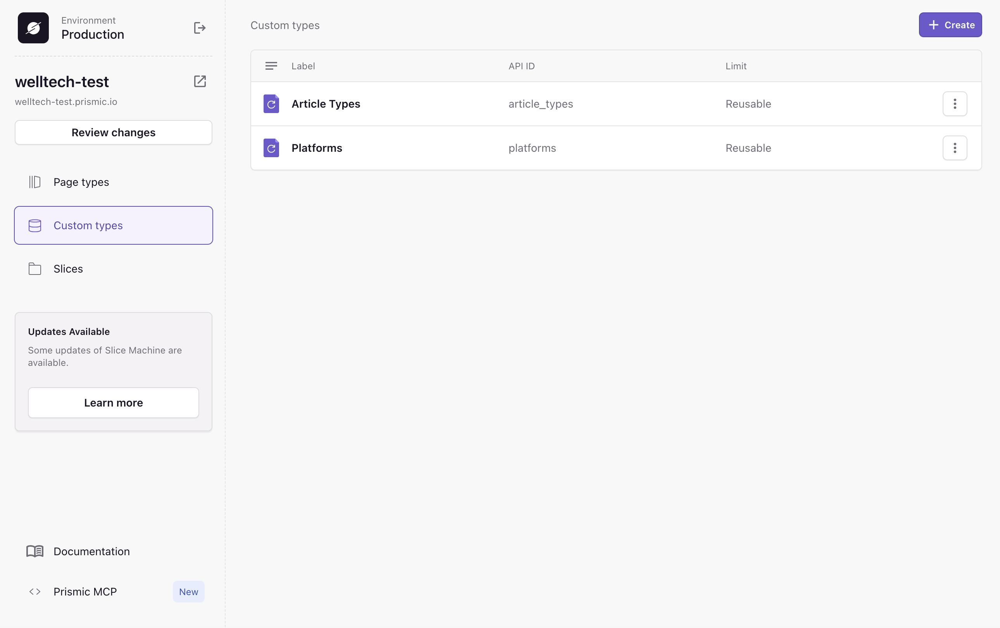
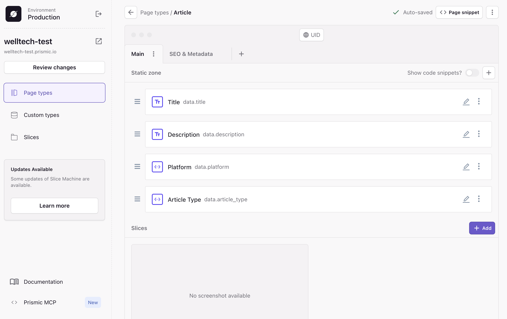
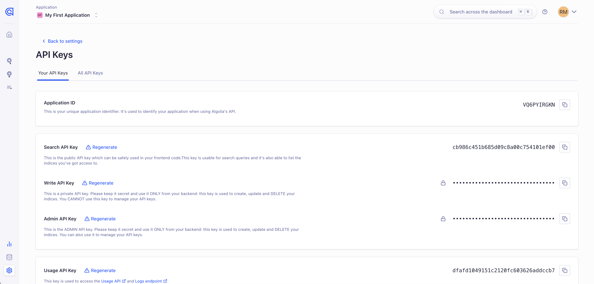
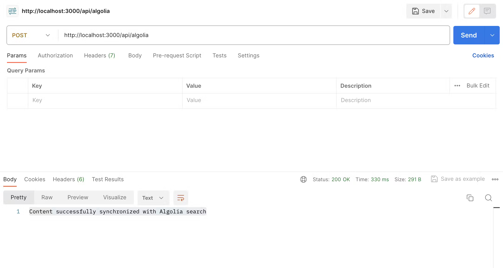
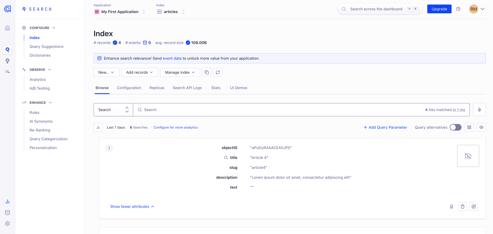

# Welltech Customer Help Experimentation

This project is a test project as part of the integration of the customer support section for [Welltech](https://welltech.com/) applications websites. 
It explores the creation of a documentation of articles with multiple categories using [Prismic](https://prismic.io/) and a search feature with [Algolia](https://www.algolia.com/). Therefore, this project should not necessarily be used as the final project, but as documentation for the implementation of these features.

This application is made using [Next.js](https://nextjs.org/) and [Prismic](https://prismic.io/).

### Table of content

- [Quick Start](#quick-start)

- [Prismic Documentation](#creating-a-documentation-with-prismic)

- [Algolia Search](#algolia-search-implementation)

&nbsp;

### Ressources

- **Demo**: <https://welltech-test.vercel.app/>

- Different pages of the project : 
[Home](https://welltech-test.vercel.app/) | [Getting Started](https://welltech-test.vercel.app/getting-started) | [Article 1](https://welltech-test.vercel.app/articles/article1) | [Article 2](https://welltech-test.vercel.app/articles/article2) | [Article 3](https://welltech-test.vercel.app/articles/article3) | [Article 4](https://welltech-test.vercel.app/articles/article4)

- **Github repository**: <https://github.com/raphael-m-prismic/welltech-test>
- **Prismic x Algolia**: [How to Add Algolia Instant Search to your Website](https://prismic.io/blog/algolia-instant-search)

&nbsp;

### Contact

**Raphaël Mendes**  
at raphael.mendes@prismic.io  

**Nathanaël Lamellière**  
at nathanael@prismic.io

&nbsp;

## Quick Start

How to start this project :

1. **Clone** this repository

2. **Install** dependencies
```
npm i
```
3. **Start** the server
```
npm run dev
```

&nbsp;

## Creating a documentation with Prismic

To create a documentation of articles with different categories using Prismic, you can use Prismic's `custom_types`.

In Slice Machine, create 2 `custom_types` for each category : **Platforms** and **Article Types**.



And in the Article page type, add two `content relationship` fields linked to platforms and article types. This is allowing you to easily create a new article type with the article custom type and link it to an article.



&nbsp;

### Server-side data fetching

Then you can create a `slice` (I called it Test) that will filter and display every article by platform and article type.

Create a server side file in it to get your custom types and all our articles via Prismic API

> `./slices/Test/index.tsx`

```
import { FC } from "react";
import { Content } from "@prismicio/client";
import { createClient } from "@/prismicio";
import { SliceComponentProps } from "@prismicio/react";
import ArticleList from "./ArticleList";

export type TestProps = SliceComponentProps<Content.TestSlice> & {
  context?: {
    allArticles?: Content.AllDocumentTypes[];
  };
};

const Test: FC<TestProps> = async ({ slice }) => {
  const client = createClient();
  const allArticles = await client.getAllByType("article");
  const allPlatforms = await client.getAllByType("platforms");
  const allTypes = await client.getAllByType("article_types");

  return (
    <ArticleList
      articles={allArticles}
      platforms={allPlatforms}
      articleTypes={allTypes}
      slice={slice}
    />
  );
};

export default Test;

```
&nbsp;

### Client-side filtering and rendering

And then another file to filter and display the articles.

> `./slices/Test/ArticleList.tsx`

**Filtering logic**

```
const [activePlatform, setActivePlatform] = useState<string>("web");

const filteredArticleTypes = articleTypes.filter((articleType) => {
    
    return articles.some(
    (article) =>
        isFilled.contentRelationship(article.data.article_type) &&
        isFilled.contentRelationship(article.data.platform) &&
        article.data.platform.uid === activePlatform &&
        article.data.article_type.uid === articleType.uid
    );
});
```

**Rendering filtered articles**

```
{filteredArticleTypes.map((articleType) => (
    <div
        key={articleType.id}
        className={styles.articles_section}
    >
        <h2 className={styles.type_title}>{asText(articleType.data.title)}</h2>

        <div className={styles.articles_list}>
        {articles.map((article) => {
            if (
            !isFilled.contentRelationship(article.data.article_type) ||
            !isFilled.contentRelationship(article.data.platform) ||
            article.data.platform.uid !== activePlatform ||
            article.data.article_type.uid !== articleType.uid
            ) {
            return null;
            }

            return (
            <div key={article.id}>
                <PrismicNextLink href={`/articles/${article.uid}`} className={styles.article}>
                    {asText(article.data.title)}
                </PrismicNextLink>
            </div>
            );
        })}
        </div>
    </div>
))}
```

&nbsp;

## Algolia Search Implementation


### Set up Algolia

1. **Go** to [Algolia.com](https://www.algolia.com/)

2. **Create** an Algolia account

3. **Create** an index

Creating an index in Algolia is a way to tell Algolia where to send and store our data. Navigate to the 'Search' tab and create a new index. Call your index **'articles'**.

4. **Install** Algolia Packages

```
npm install algoliasearch@^4.23.3
```

> [!NOTE]
> I used algoliasearch `v4.23.3` to avoid any breaking API changes.  
> In v5 and later, methods like `initIndex()` or `initSearch()` no longer exist and would have caused runtime errors such as `client.initIndex is not a function`.

&nbsp;

### Indexing the data to Algolia

Before you index the data, let's inform your application about the Algolia credentials. You can find them in the ['API Keys' section in the Algolia dashboard'](https://dashboard.algolia.com/account/api-keys/). From here, you want to copy your **Application ID,** **Search-Only API Key,** and **Admin API Key**.



Then, at the root of your project, create a **.env** file. In this file, include the credentials as follows:

```
NEXT_PUBLIC_ALGOLIA_APP_ID= Application ID
NEXT_PUBLIC_ALGOLIA_SEARCH_ONLY_API_KEY= Search API Key

ALGOLIA_APP_ID= Application ID
ALGOLIA_ADMIN_API_KEY= Admin API Key
```

To index your data on Algolia, you need to send the content from the CMS to Algolia. This data also needs to be processed correctly. A good solution for this is to create an API route in Next.js. Let’s create a new directory in `./app/api/algolia`, and inside, add a file called `route.js`, then add the following code:

> `./app/api/algolia/route.js`

```
import algoliasearch from "algoliasearch";
import { createClient } from "@/prismicio";
import { asText } from "@prismicio/client";

// Transform Prismic slices to indexable text for Algolia
const transformSlices = (slices) => {
  const textStrings = slices.map((slice) => {
    if (!slice) return "";
    switch (slice.slice_type) {
      case "text":
        return asText(slice.primary.text);
      case "image":
        return asText(slice.primary.caption);
      case "quote":
        return `${asText(slice.primary.quote)} ${slice.primary.source || ""}`;
      default:
        return "";
    }
  });

  return textStrings.join(" ");
};

export async function POST() {
  // Check environment variables exist
  if (!process.env.ALGOLIA_APP_ID || !process.env.ALGOLIA_ADMIN_API_KEY) {
    return new Response("Algolia credentials are not set", { status: 500 });
  }

  try {
    console.log("1️⃣ Start POST");

    // Init Prismic et Algolia clients
    const prismicClient = createClient();
    const algoliaClient = algoliasearch(
      process.env.ALGOLIA_APP_ID,
      process.env.ALGOLIA_ADMIN_API_KEY
    );
    console.log("2️⃣ Algolia Client created");

    // Get 'articles' index or create it
    const index = algoliaClient.initIndex("articles");
    console.log("3️⃣ Index retrieved");

    // Retrieve all articles from Prismic
    const articles = await prismicClient.getAllByType("article");
    console.log(`4️⃣ ${articles.length} articles retrieved from Prismic`);

    // Transform articles into objects in Algolia
    const articleRecords = articles.map((post) => ({
      objectID: post.id,
      title: asText(post.data.title),
      slug: post.uid,
      description: post.data.description[0].text,
      text: transformSlices(post.data.slices),
    }));

    console.log("5️⃣ Articles transformed for Algolia");

    // Send objects to the index in Algolia
    await index.saveObjects(articleRecords);
    console.log("6️⃣ Articles sent to Algolia");

    return new Response(
      "Content successfully synchronized with Algolia search",
      { status: 200 }
    );
  } catch (error) {
    console.error("❌ Algolia sync error:", error);
    return new Response(
      "An error occurred while synchronizing content",
      { status: 500 }
    );
  }
}

```
&nbsp;

### Testing the API route in Postman

For testing API requests, I used Postman because of its simplicity and versatility. It lets me construct and send various types of HTTP requests, view responses within the same tool, and automate testing processes.

Getting started with Postman is really easy. Just download their desktop app [here](https://www.postman.com/downloads/).

Once you have Postman installed, fire it up and open a new tab. Change the request type from `GET` to `POST` and fill the `http://localhost:3000/api/algolia` to the URL field next to it.



Then click on “Send”, and you should hopefully get the body “Content successfully synchronized with Algolia search” back. And if you then visit your index in the Algolia dashboard and refresh the page, you should see your new data there.



&nbsp;

### Implementing Search on your Application

You can create a <Search /> component.

> `./components/Search/Search.tsx`

**Where you call Algolia and store the results in the state hits**

```
  const searchAlgolia = async (q: string) => {
    if (!q) {
      setHits([]);
      return;
    }

    try {
      const res = await fetch(
        `https://${process.env.NEXT_PUBLIC_ALGOLIA_APP_ID}-dsn.algolia.net/1/indexes/articles/query`,
        {
          method: "POST",
          headers: {
            "Content-Type": "application/json",
            "X-Algolia-API-Key": process.env.NEXT_PUBLIC_ALGOLIA_SEARCH_ONLY_API_KEY!,
            "X-Algolia-Application-Id": process.env.NEXT_PUBLIC_ALGOLIA_APP_ID!,
          },
          body: JSON.stringify({ query: q }),
        }
      );

      const data = await res.json();
      setHits(data.hits);
    } catch (err) {
      console.error("Algolia search error:", err);
    } 
  };
```

**And render the hits as clickable links**

```
{hits.length > 0 && (
  <div className={styles.hits}>
    {hits.map((hit) => (
      <a key={hit.objectID} href={`/articles/${hit.slug}`} className={styles.hit}>
        <span className={styles.title}>{hit.title}</span>
        <span className={styles.desc}>{hit.description}</span>
      </a>
    ))}
  </div>
)}
```
&nbsp;

### Creating a result page

In Prismic create a new single `page type` called **Search Results** where you will redirect the user when they make a query in the search bar.

Then in the search component, listen when the user presses Enter in the search field to redirect them to the results page with the query as a URL parameter.

> `./components/Search/Search.tsx`

```
  const handleKeyDown = (e: React.KeyboardEvent<HTMLInputElement>) => {
    if (e.key === "Enter" && query.trim()) {
      e.preventDefault();
      router.push(`/search_results/?query=${encodeURIComponent(query)}`);
    }
  };

```

Finally, create a **Results** component that you will use in your **Search Results** page and where you will display all the corresponding articles to the query.

> `./components/Results/Results.tsx`

**Retrieving the query from the URL**

```
const searchParams = useSearchParams();
const query = searchParams.get("query") || "";
```

**Data retrieval (fetch Algolia)**

```
useEffect(() => {
  if (!query) return;

  const fetchResults = async () => {
    setLoading(true);
    try {
      const res = await fetch(
        `https://${process.env.NEXT_PUBLIC_ALGOLIA_APP_ID}-dsn.algolia.net/1/indexes/articles/query`,
        {
          method: "POST",
          headers: {
            "Content-Type": "application/json",
            "X-Algolia-API-Key": process.env.NEXT_PUBLIC_ALGOLIA_SEARCH_ONLY_API_KEY!,
            "X-Algolia-Application-Id": process.env.NEXT_PUBLIC_ALGOLIA_APP_ID!,
          },
          body: JSON.stringify({ query }),
        }
      );
      const data = await res.json();
      setHits(data.hits);
    } catch (err) {
      console.error("Algolia search error:", err);
    } finally {
      setLoading(false);
    }
  };

  fetchResults();
}, [query]);

```

**Displaying results**

```
{query && (
  <div className={styles.results} >
    {loading && <p>Loading...</p>}
    {!loading && hits.length === 0 && <p>No results found.</p>}
      {hits.map((hit) => (
        <a key={hit.objectID} href={`/articles/${hit.slug}`} className={styles.hit}>
          <span className={styles.title}>{hit.title}</span>
          <span className={styles.desc}>{hit.description}</span>
        </a>
      ))}
  </div>
)}

```
